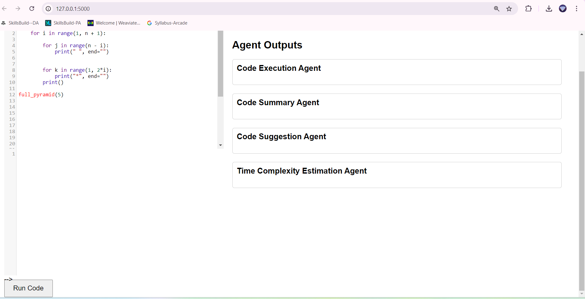

# 🧙‍♂️ Syntax Sage

Syntax Sage is an intelligent web application designed to enhance coding education through automated code analysis and feedback. Leveraging CrewAI, it employs a team of AI agents to provide comprehensive insights into submitted code.

## 🖥️ User Interface

Syntax Sage provides an intuitive user interface for code analysis. Below is a screenshot of the main interface:



The interface consists of two main sections:

1. **Code Input (Left Side)**: 
   - A text area where users can input their Python code.
   - The image shows a sample Python function for creating a full pyramid pattern.
   - A "Run Code" button at the bottom to submit the code for analysis.

2. **Agent Outputs (Right Side)**:
   - Four distinct sections for different types of analysis:
     - Code Execution Agent
     - Code Summary Agent
     - Code Suggestion Agent
     - Time Complexity Estimation Agent
   - Each agent provides specialized feedback in its respective section.

This layout allows users to easily input their code and receive comprehensive feedback from multiple perspectives, all in one view.


## ✨ Features

1. **🤖 Automated Code Analysis**: Utilizes a crew of AI agents to analyze submitted code from multiple perspectives.
2. **🏃‍♂️ Code Compilation and Execution**:  Compiles and executes code, providing immediate output or error messages.
3. **🔧 Optimization Suggestions**: Analyzes code for optimization opportunities and calculates time and space complexity.
4. **📚 Comprehensive Explanations**: Generates clear, concise summaries and explanations of code structures and algorithms.
5. **📊 Performance Tracking**: Monitors and analyzes student coding patterns over time, tracking improvements in various aspects.

## 🛠️ Tech Stack

- Backend: Python, Flask
- AI Framework: CrewAI
- Language Models: Ollama (llama3.1:latest)
- Frontend: HTML, CSS (embedded in Flask template)

## 🤖 AI Agents

Syntax Sage employs four specialized AI agents:

1. **👨‍💻 Code Compiler and Executor**: Compiles and executes submitted code accurately.
2. **🔍 Code Optimization Specialist**: Analyzes code for optimization opportunities and complexity.
3. **📘 Code Explanation Expert**: Generates clear summaries and explanations of code.
4. **📈 Student Performance Analyst**:: Monitors and analyzes student coding patterns over time.

## 📋 Prerequisites

Before you begin, ensure you have met the following requirements:

- Python 3.7+
- pip (Python package manager)
- Ollama installed and running with the llama3.1:latest model

## 🚀 Installation

1. **Clone the repository**
   ```
   git clone https://github.com/akhil-varsh/SyntaxSage.git
   ```
2. **Navigate to Folder**
   ```bash
   cd SyntaxSage
   ```

2. **Create a virtual environment (optional but recommended)**
   ```
   python -m venv venv
   source venv/bin/activate  # On Windows, use `venv\Scripts\activate`
   ```

3. **Install the required packages**
   ```
   pip install flask crewai langchain-community
   ```

## 🎯 Usage

1. Start the Flask application:
   ```
   python app.py
   ```

2. Open your web browser and navigate to `http://localhost:5000`.

3. In the left panel, enter your code in the text area provided.

4. Click the "Analyze Code" button to submit your code.

5. View the results in the right panel, which will include output from all four AI agents:
   - Compilation and execution results
   - Optimization and complexity analysis
   - Code explanation and summary
   - Performance tracking insights


## ⚙️ How It Works

1. When code is submitted, Syntax Sage creates tasks for each AI agent based on the input.
2. The CrewAI framework orchestrates these agents, allowing them to work together to analyze the code.
3. Each agent performs its specialized task:
   - The Code Compiler and Executor compiles and runs the code.
   - The Code Optimization Specialist analyzes for improvements and complexity.
   - The Code Explanation Expert provides a clear summary.
   - The Student Performance Analyst tracks progress over time.
4. The results from all agents are collected and presented in the user interface.

## 🤝 Contributing

Contributions to Syntax Sage are welcome! 

## 📄 License

This project is licensed under the MIT License - see the [LICENSE](LICENSE) file for details.

## 👏 Acknowledgments

- Thanks to the CrewAI team for their powerful AI orchestration framework.


